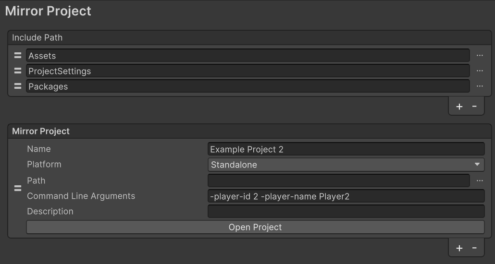
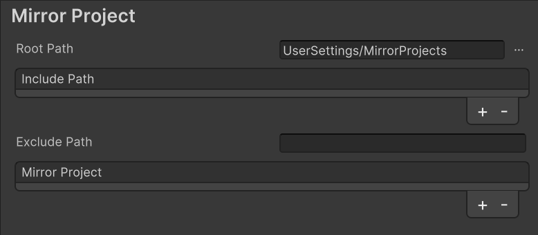

通过软链接文件夹, 实现 Unity 编辑器多开, 用于本机多人联机调试, 多平台多开

避免下载多个git代码仓库

- 项目过大, 硬盘空间不足

- 代码修改直接在多个工程之间同步, 不需要提交代码

## 使用

1. 打开[设置界面](#配置), 菜单: `Project Settings/Mirror Project`
2. 添加 `Mirror Project` 镜像工程配置
3. 点击 `Open Project` 按钮, 打开镜像工程


## 配置

配置界面 `Project Settings/Mirror Project`



| 字段                   | 描述                                                         |
| ---------------------- | ------------------------------------------------------------ |
| Include Path           | 软链接的目录列表, 默认包含 `Assets/ProjectSettings/Packages` |
| **Mirror Project**     | 镜像工程配置列表, 支持多个配置                               |
| Name                   | 新项目文件夹名称, 默认位置为: `UserSettings\MirrorProjects\[Name]` |
| Platform               | 新项目的平台, 如 Standalone/Server/Android                   |
| Path                   | 指定项目根目录 `[Path]\[Name]`                               |
| Command Line Arguments | 启动编辑器时的命令行参数                                     |
| Description            | 描述信息                                                     |
| Open Project           | 打开新工程按钮                                               |


**获取命令行参数**

```c#
Debug.Log($"Command Line Arguments:\n{string.Join("\n", Environment.GetCommandLineArgs())}");
```

输出

```tex
Command Line Arguments:
C:\Program Files\...\Editor\Unity.exe
-projectPath
...\UserSettings\MirrorProjects\Example Project 2
-player-id
2
-player-name
Player2
```


## 镜像工程位置

默认位置为: `UserSettings\MirrorProjects`

**定制位置**

菜单 `Edit/Perferences/Mirror Project` 打开用户设置面板



设置 `Root Path` 字段